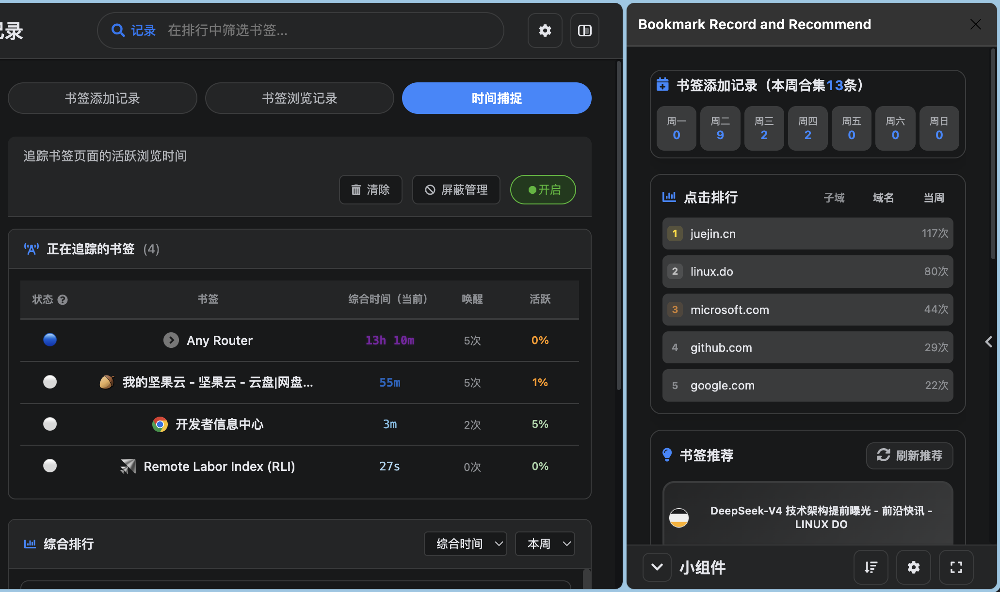
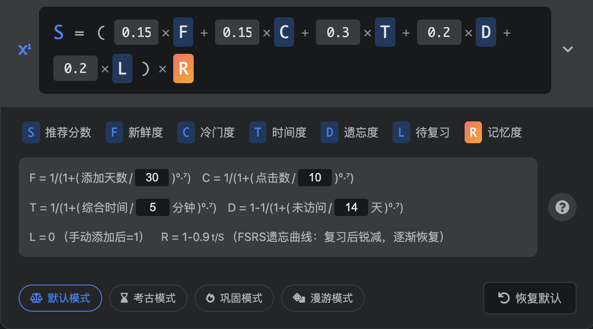
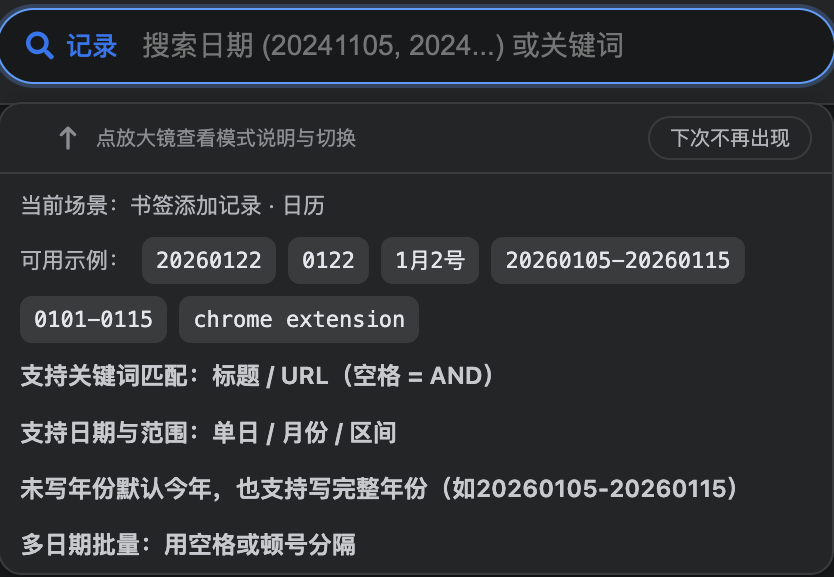
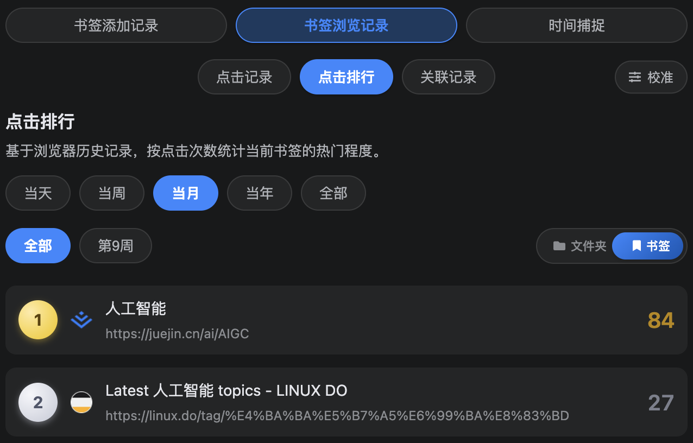
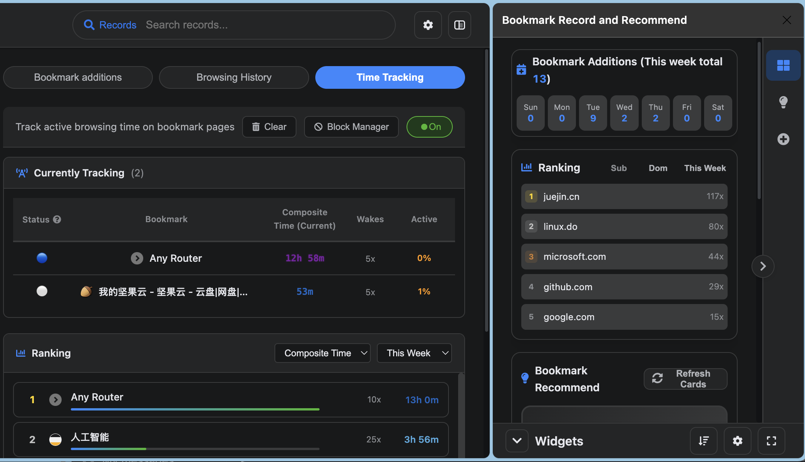
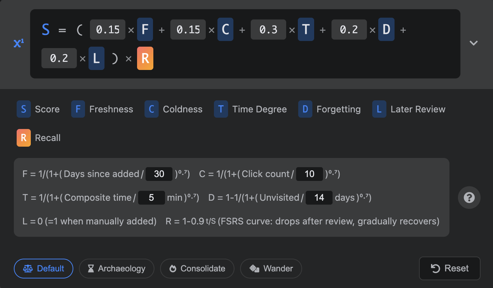
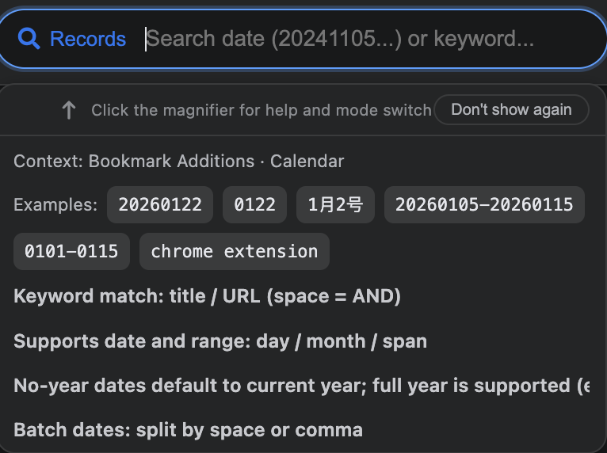
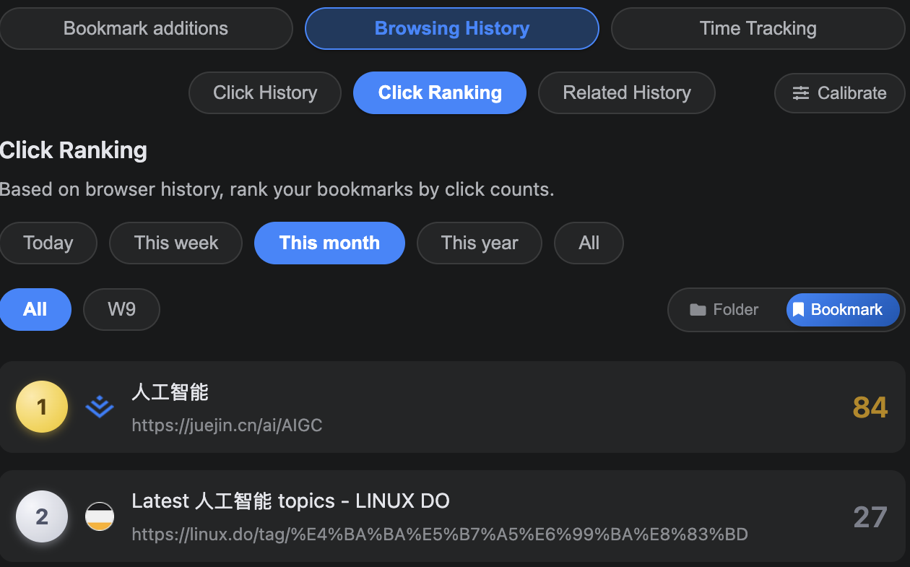

## Switch to [English](#english)

### 简介
`书签记录与推荐` 是一款专为重度书签用户打造的增强型扩展，旨在通过“书签记录”与“智能推荐”两大核心引擎，唤醒你在浏览器中沉睡的知识库。
它不仅支持多维度的书签浏览数据追踪（日历记录、访问排行与关联组合），还独创了基于“书签记录”获得的参数计算出 S 值的书签动态推荐算法，并在侧边栏与独立网页中提供无缝的双轨使用体验。

### 特色功能
- **双工作区**：支持 Side Panel + 独立 HTML 页面，适配不同使用习惯。
- **推荐引擎（v6.2）**：基于 S 值与池子模型，支持三卡位轮换与优先复习队列。
- **推荐操作语义清晰**：`待复习 / 跳过 / 屏蔽` 三种操作可直接影响后续推荐。
- **书签记录三件套**：书签添加记录、点击排行、关联记录（含日历与筛选）。
- **时间捕捉与排行**：按书签页面活跃时长统计，支持多时间范围查看。
- **校准机制**：支持手动/自动校准浏览历史，降低删除历史后的数据偏差。
- **上下文搜索**：同一个搜索框按场景切换，支持关键词、日期区间、S 值筛选。
- **中英文 + 主题切换**：自动语言识别，支持明暗主题。

### 预览
| 侧边栏 | 推荐公式|
| :---: | :---: |
|  |  |
| **搜索** | **点击排行** |
|  |  |

### 主要视图
- **小组件**：聚合小组件（推荐、时间捕捉、排行、周统计等）。
- **书签推​​荐**：推荐卡片、待复习、屏蔽管理、复习热力图。
- **书签记录**：添加记录 / 浏览记录 / 时间捕捉。

### 数据与隐私
- 核心记录与推荐状态保存在浏览器本地存储（无独立后端服务）。
- 插件会请求书签、历史记录、标签页等权限以提供完整功能。
- favicon 可能通过站点图标或公共 favicon 源加载。

### 相关文档
- `doc/RECOMMEND_POOLS_V6_2.md`：推荐池模型与流转规则（v6.2）

---

## English

### Overview
`Bookmark Record & Recommend` is an enhanced browser extension specifically designed for power bookmark users. It aims to reawaken the dormant knowledge base within your browser through two core engines: "Bookmark Records" and "Smart Recommendations".
It not only tracks multi-dimensional bookmark browsing data (calendar logs, visit rankings, and combined history), but also features a dynamic recommendation algorithm that calculates unique S-Scores based on parameters derived from your "Bookmark Records", offering a seamless dual-track experience in both the Side Panel and standalone web pages.

### Highlights
- **Dual workspace**: works in Side Panel and standalone page.
- **Recommendation engine (v6.2)**: S-score + pool model with 3-card rotation and due-first queue.
- **Actionable recommendation controls**: `Review Later / Skip / Block` directly shape future recommendations.
- **Bookmark record suite**: additions, click ranking, and related history with calendar/filter views.
- **Active-time tracking**: weighted bookmark-page activity with range-based ranking.
- **Calibration tools**: manual + auto calibration to realign data after history deletions.
- **Context-aware search**: one search box, multiple modes (keywords, date ranges, S-score filters).
- **Bilingual + themes**: auto language detection and light/dark themes.

### Preview

| Sidebar | Recommend |
| :---: | :---: |
|  |  |
| **Search** | **Ranking** |
|  |  |

### Main Views
- **Widgets**: consolidated widgets for recommendations, tracking, ranking, weekly summaries.
- **Bookmark Recommend**: recommendation cards, review-later queue, block manager, review heatmap.
- **Bookmark Records**: additions / browsing history / time tracking.

### Data & Privacy
- Core states are stored locally in browser storage (no dedicated backend service).
- Permissions include bookmarks/history/tabs to support full functionality.
- Favicons may be loaded from site icons or public favicon providers.

### Docs
- `doc/RECOMMEND_POOLS_V6_2.md`: recommendation pool model and flow rules (v6.2)

---

## License

GPL-3.0

## [Back to top ](#switch-to-english)
